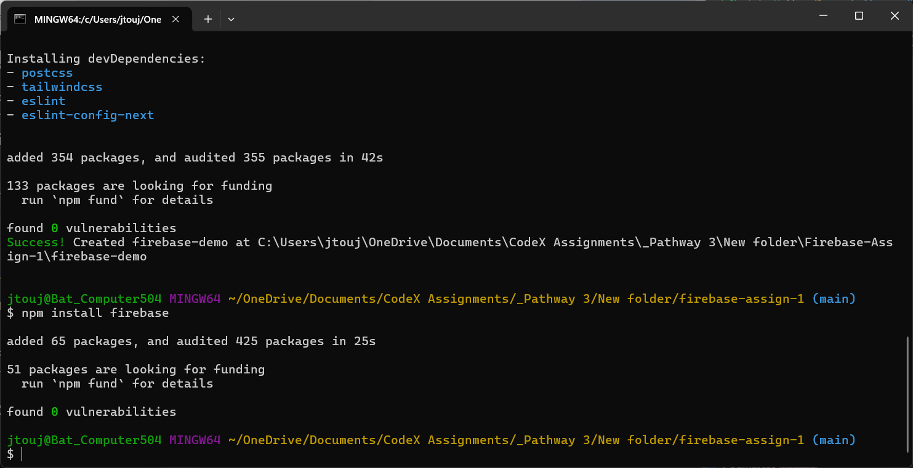
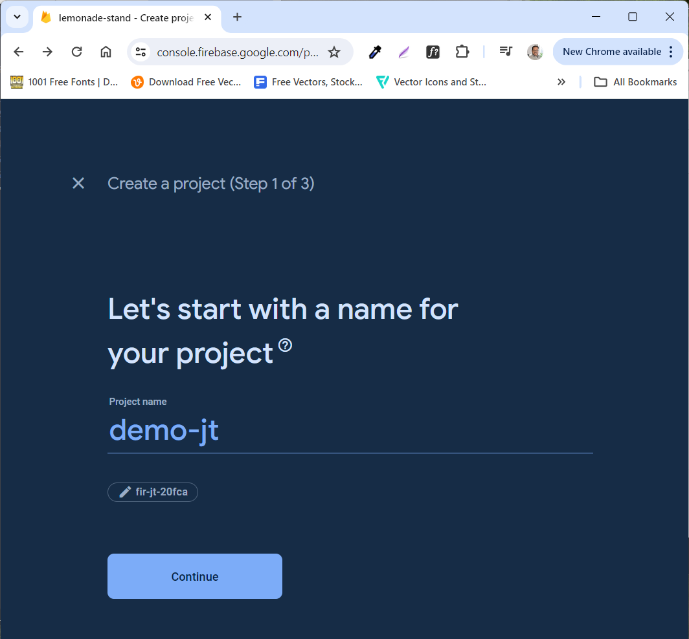
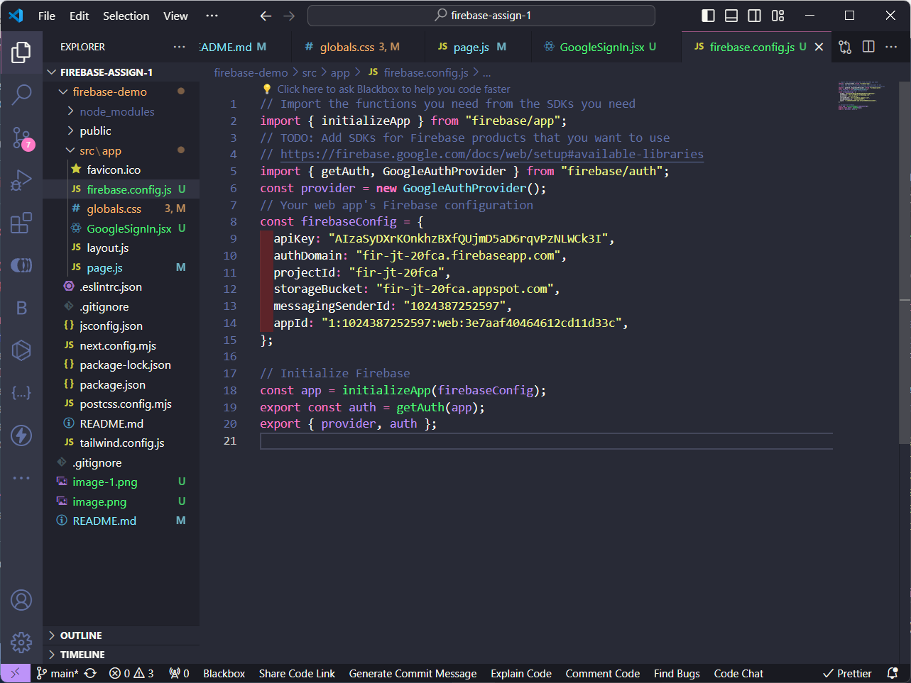
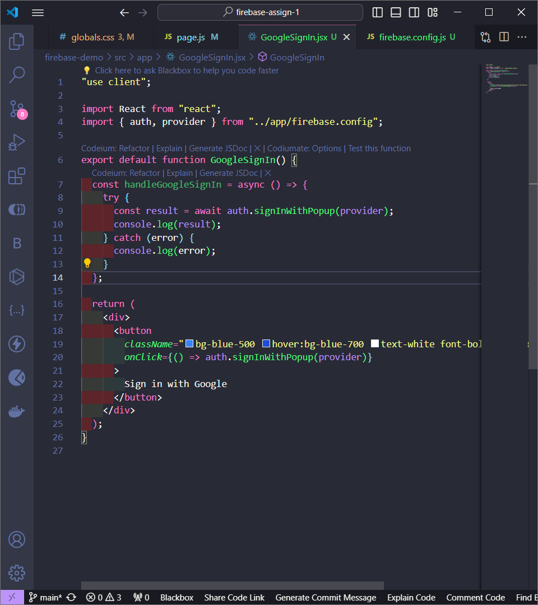

# Firebase Assignment 1

I installed react and firebase to my project. Then I use the code above in App.js file:

Created a new firebase project.

Set up my firebase config file.

Then I added a button and the scipt to handle it's click event. When clicked, it prompts you to log in with google.
